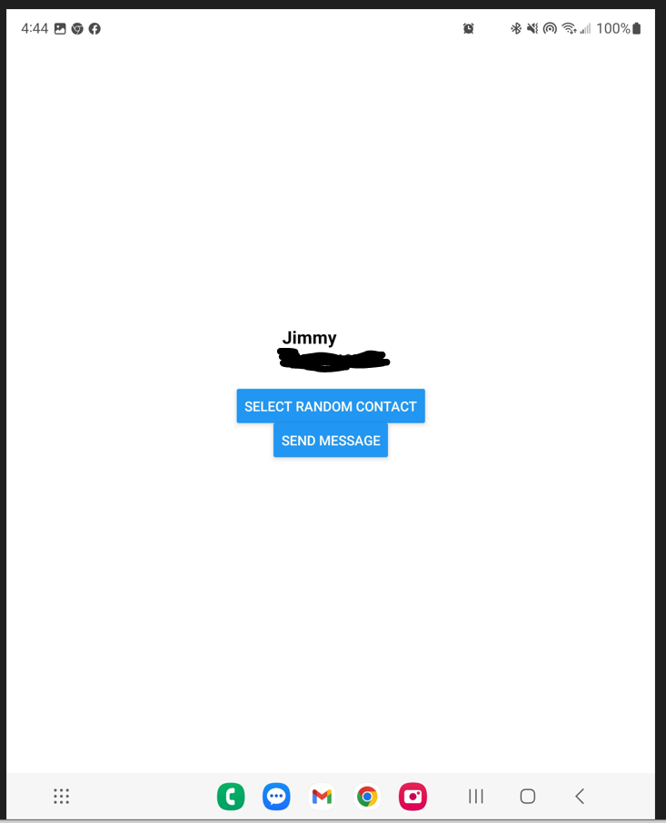
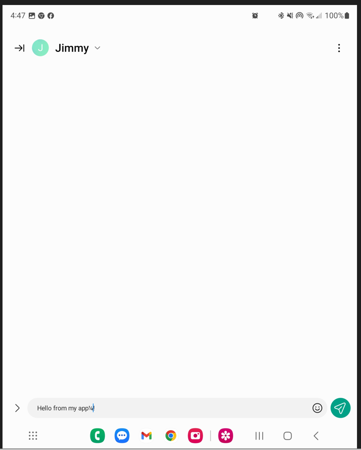

# Random Texting App

## Features

- Day 1
  - Click the the Select random contact to send a text to someone in your contact list
  - Why? IDK!
  - Hit the Send Message button to open up your default messaging app. 
  - Default Message is currently Hello From My App!

- Day 2
  - Added Point system
  - Made the random contact list stop working after 5 tries
  - Added an array of random messages
  - Added round timer
  - Styled the app

## Screen Shots

